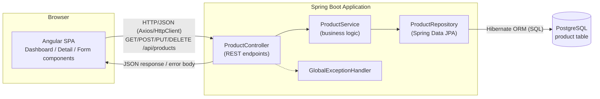
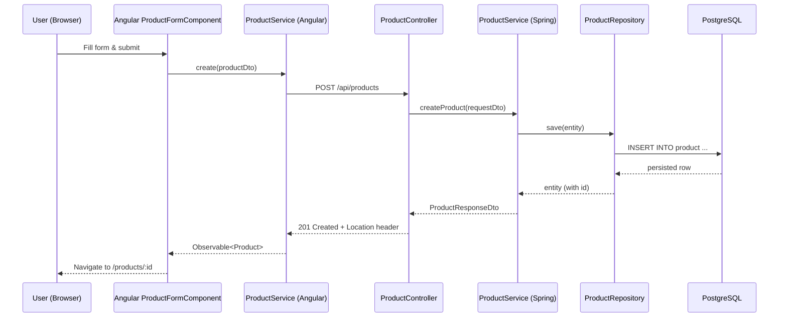

# Architecture.md

## 1. Overview
Three-tier web application:

```
[Angular SPA] --HTTP/JSON (REST)--> [Spring Boot API] --JPA/Hibernate--> [PostgreSQL]
```

## 1a. Architecture Diagram



### Request Flow (Create example)


## 2. Technology Stack
| Layer | Technology |
|---|---|
| Frontend | Angular (latest LTS), TypeScript, Angular Router, Angular Reactive Forms, HttpClient, RxJS |
| Backend | Spring Boot 3.x, Java 17+, Spring Web (REST), Spring Data JPA, Hibernate |
| Database | PostgreSQL |
| Build | Maven (backend), Angular CLI / npm (frontend) |
| Test | JUnit 5 + Mockito + Spring Boot Test + Testcontainers (backend); Jasmine/Karma + Angular TestBed (frontend) |

## 3. Component View

### Frontend (Angular)
- `ProductModule`
  - `DashboardComponent` — lists products, links to detail, delete action.
  - `ProductDetailComponent` — view/edit a single product.
  - `ProductFormComponent` — reusable create/edit form (reactive form).
  - `ProductService` — wraps `HttpClient`, calls backend REST endpoints.
  - `Product` model/interface.
  - `ConfirmDialogComponent` — shared delete confirmation.
- Routing:
  - `/products` → DashboardComponent
  - `/products/new` → ProductFormComponent (create mode)
  - `/products/:id` → ProductDetailComponent
  - `/products/:id/edit` → ProductFormComponent (edit mode)

### Backend (Spring Boot) — layered architecture
- `controller` — `ProductController` (REST endpoints, request/response DTOs)
- `service` — `ProductService` / `ProductServiceImpl` (business logic, transaction boundary)
- `repository` — `ProductRepository extends JpaRepository<Product, Long>`
- `entity` — `Product` (JPA entity)
- `dto` — `ProductRequestDto`, `ProductResponseDto`
- `mapper` — `ProductMapper` (entity <-> DTO, MapStruct or manual)
- `exception` — `ProductNotFoundException`, `GlobalExceptionHandler` (`@ControllerAdvice`)
- `config` — CORS config, OpenAPI/Swagger config

## 4. REST API Contract (see specification.md for full detail)
- `GET /api/products` — list all
- `GET /api/products/{id}` — get one
- `POST /api/products` — create
- `PUT /api/products/{id}` — update
- `DELETE /api/products/{id}` — delete

## 5. Data Model
```
Product
- id: Long (PK, auto-generated)
- name: String (required, max 255)
- description: String (nullable, max 1000)
- price: BigDecimal (required, >= 0)
- quantity: Integer (required, >= 0)
- createdDate: Instant (auto-set on create)
- updatedDate: Instant (auto-set on update)
```

## 6. Cross-Cutting Concerns
- **CORS**: backend explicitly allows the Angular dev origin (`http://localhost:4200`) via `WebMvcConfigurer`.
- **Validation**: `jakarta.validation` annotations on DTOs (`@NotBlank`, `@PositiveOrZero`), errors mapped to 400 with field messages.
- **Error handling**: global `@ControllerAdvice` maps `ProductNotFoundException` → 404, validation errors → 400, unhandled → 500 with a consistent JSON error body `{timestamp, status, error, message, path}`.
- **Schema management**: Flyway migrations (`V1__create_product_table.sql`) preferred over `hibernate.ddl-auto=update` for anything beyond local dev, to keep schema changes explicit and reviewable.
- **Dummy/seed data**: Flyway `V2__seed_products.sql` or a `@Profile("dev")` `CommandLineRunner`.
- **Logging**: SLF4J via Spring Boot defaults; log request errors at WARN/ERROR in the exception handler.
- **Configuration**: `application.yml` per environment (`dev`, `test`, `prod`) with externalized DB credentials via env vars.

## 7. Deployment Topology (baseline, not required by current scope)
- Angular built as static assets, served via Nginx or any static host.
- Spring Boot packaged as an executable jar / container image.
- PostgreSQL as a managed or containerized instance.
- Angular calls backend via a configured `apiBaseUrl` (environment.ts / environment.prod.ts).

## 8. Key Architectural Decisions
| Decision | Choice | Rationale |
|---|---|---|
| API style | REST/JSON | Explicitly required |
| ORM | Hibernate via Spring Data JPA | Explicitly required |
| Schema mgmt | Flyway | Avoids implicit/fragile `ddl-auto` in anything beyond local dev |
| DTOs vs exposing entities | Use DTOs | Decouples API contract from persistence model, avoids Hibernate lazy-loading serialization issues |
| Frontend state | Component + service (no NgRx) | CRUD scope doesn't justify a global store; revisit if app grows |
| Delete confirmation | Client-side modal, then hard delete | Simplicity; soft-delete not required by scope |
