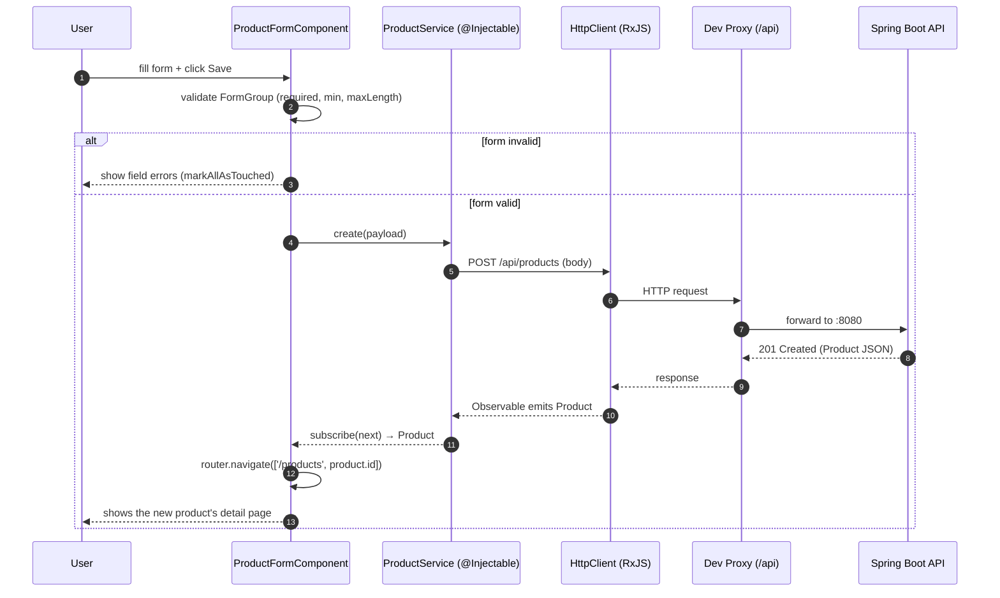

# Angular Frontend Architecture Guide (Interview Prep)

> A mentor-style, file-by-file walkthrough of the `frontend/` Angular app.
> Learn **how a user action flows through Angular components → services → HttpClient → the Spring Boot API** and back.
> Repo: `getdipakkumar2008-coder/AngularAppwithREST` · Stack: **Angular (NgModule-based) + TypeScript + RxJS + Reactive Forms**

---

## Table of Contents
1. [The Big Picture](#1-the-big-picture)
2. [Folder & File Map](#2-folder--file-map)
3. [Angular Building Blocks](#3-angular-building-blocks)
4. [File-by-File Explanation](#4-file-by-file-explanation)
5. [End-to-End Data Flow (with Mermaid diagram)](#5-end-to-end-data-flow)
6. [How the Frontend Talks to the Backend](#6-how-the-frontend-talks-to-the-backend)
7. [Interview Q&A by Phase](#7-interview-qa-by-phase)
8. [Glossary](#8-glossary)

---

## 1. The Big Picture

This is a **Product management SPA (Single Page Application)** that consumes the Spring Boot
REST API documented in [`docs/backend/`](backend/README.md). It uses the classic Angular
**module → routing → components → service → HttpClient** structure.

```
User (browser)
   │ clicks / types
   ▼
Component (dashboard / form / detail)   ← UI + event handlers
   │ calls
   ▼
ProductService (@Injectable)            ← single place that knows the API
   │ HttpClient + RxJS Observable
   ▼
Angular dev-server proxy (/api → :8080)
   │ HTTP JSON
   ▼
Spring Boot REST API (/api/products)
```

**One-line summary for an interview:**
> "Components handle the UI and delegate all HTTP to an injectable `ProductService`, which uses
> `HttpClient` to call the REST API and returns RxJS `Observable`s. The router maps URLs to
> components, and Reactive Forms handle input with validation."

---

## 2. Folder & File Map

```
frontend/
├── angular.json            # Angular CLI workspace/build config
├── package.json            # npm dependencies & scripts
├── proxy.conf.json         # Dev proxy: forwards /api → http://localhost:8080
└── src/
    ├── main.ts             # Bootstraps AppModule
    ├── index.html          # Single HTML page (the "S" in SPA)
    ├── styles.css          # Global styles
    ├── environments/
    │   ├── environment.ts        # apiUrl for dev  ('/api/products')
    │   └── environment.prod.ts   # apiUrl for prod
    └── app/
        ├── app.module.ts            # Root NgModule (declares & wires everything)
        ├── app-routing.module.ts    # URL → component routes
        ├── app.component.*          # Root shell component
        ├── models/
        │   └── product.model.ts     # TypeScript interfaces (Product, ProductRequest)
        ├── services/
        │   └── product.service.ts   # 🌐 HTTP layer (talks to REST API)
        ├── dashboard/               # List all products (+ delete)
        ├── product-detail/          # View one product (+ edit/delete)
        └── product-form/            # Create/Edit product (Reactive Form)
```

---

## 3. Angular Building Blocks

| Block | What it is | Example here |
|-------|-----------|--------------|
| **Module** (`@NgModule`) | Groups & wires components, imports libraries | `AppModule` |
| **Component** (`@Component`) | A view (template + class + styles) | `DashboardComponent` |
| **Service** (`@Injectable`) | Reusable logic, shared via DI | `ProductService` |
| **Router** | Maps URLs to components | `app-routing.module.ts` |
| **HttpClient** | Makes HTTP calls, returns Observables | inside `ProductService` |
| **RxJS Observable** | Async stream you `subscribe()` to | every service method |
| **Reactive Forms** | Model-driven forms with validation | `ProductFormComponent` |
| **Model/Interface** | TypeScript shape of data | `Product`, `ProductRequest` |

---

## 4. File-by-File Explanation

### 🧩 `app.module.ts` — the root module
- `declarations`: the app's components (`AppComponent`, `DashboardComponent`,
  `ProductDetailComponent`, `ProductFormComponent`).
- `imports`: Angular libraries — `BrowserModule`, `HttpClientModule` (enables `HttpClient`),
  `ReactiveFormsModule` (enables reactive forms), and `AppRoutingModule`.
- `bootstrap: [AppComponent]` — the component Angular renders first.

### 🗺️ `app-routing.module.ts` — the routes
```ts
{ path: '', redirectTo: 'products', pathMatch: 'full' },
{ path: 'products', component: DashboardComponent },
{ path: 'products/new', component: ProductFormComponent },
{ path: 'products/:id', component: ProductDetailComponent },
{ path: 'products/:id/edit', component: ProductFormComponent }
```
- Maps each URL to a component. `:id` is a **route parameter** read via `ActivatedRoute`.
- Note `products/new` is declared **before** `products/:id` so "new" isn't treated as an id.

### 🧱 `models/product.model.ts` — the data contracts
- `Product` — the full object returned by the API (includes `id`, timestamps).
- `ProductRequest` — the input shape for create/update (no `id`/timestamps).
- These mirror the backend's `ProductResponseDto` / `ProductRequestDto` — type safety across the wire.

### 🌐 `services/product.service.ts` — the HTTP layer (heart of the app)
```ts
@Injectable({ providedIn: 'root' })
export class ProductService {
  private readonly apiUrl = environment.apiUrl;   // '/api/products'
  constructor(private http: HttpClient) {}
  getAll()   { return this.http.get<Product[]>(this.apiUrl); }
  getById(id){ return this.http.get<Product>(`${this.apiUrl}/${id}`); }
  create(p)  { return this.http.post<Product>(this.apiUrl, p); }
  update(id,p){ return this.http.put<Product>(`${this.apiUrl}/${id}`, p); }
  delete(id) { return this.http.delete<void>(`${this.apiUrl}/${id}`); }
}
```
- `providedIn: 'root'` → one shared singleton, injectable anywhere.
- Each method maps 1:1 to a REST endpoint and returns a typed **`Observable`**.
- Components never build URLs themselves — the API lives **only** here (single source of truth).

### 📋 `dashboard/dashboard.component.ts` — list view
- On `ngOnInit()` calls `productService.getAll().subscribe(...)`.
- Tracks `loading` and `error` flags for UX.
- `onDeleteClick()` confirms, then calls `delete()` and **optimistically** filters the deleted item
  out of the local `products` array.
- Uses `Router.navigate([...])` to move to detail/create pages.

### 🔍 `product-detail/product-detail.component.ts` — single view
- Reads the `:id` route param via `ActivatedRoute.snapshot.paramMap`.
- Calls `getById(id)`; sets `error = 'Product not found.'` on failure (matches backend's 404).
- Offers edit/delete/back navigation.

### ✏️ `product-form/product-form.component.ts` — create & edit (Reactive Forms)
- Builds a `FormGroup` with `FormBuilder` and validators that **mirror the backend DTO**:
  `required`, `maxLength(255/1000)`, `min(0)`.
- Detects edit mode by the presence of an `:id` param; in edit mode it `patchValue`s the loaded product.
- `onSubmit()` blocks invalid forms (`markAllAsTouched`), then calls `update()` or `create()` and
  navigates to the detail page on success.

### ⚙️ Config files
- `environments/environment.ts` → `apiUrl: '/api/products'` (relative; the proxy handles the host).
- `proxy.conf.json` → forwards `/api` to `http://localhost:8080` during `ng serve`, so the browser
  never makes a cross-origin call in dev.

---

## 5. End-to-End Data Flow

Follow **"user opens the dashboard"** (a `GET`) and **"user creates a product"** (a `POST`).

### Text trace — loading the product list
```
① User navigates to /products
② Router renders DashboardComponent
③ ngOnInit() → productService.getAll()
④ HttpClient issues GET /api/products (returns an Observable)
⑤ Dev proxy forwards /api → http://localhost:8080/api/products
⑥ Spring Boot returns JSON array
⑦ .subscribe(next) runs → component.products = [...] → template renders the list
   (on error → component.error is shown instead)
```

### Mermaid sequence diagram — creating a product


---

## 6. How the Frontend Talks to the Backend

| Frontend | HTTP | Backend endpoint |
|----------|------|------------------|
| `getAll()` | `GET /api/products` | `ProductController.getAllProducts()` |
| `getById(id)` | `GET /api/products/{id}` | `getProductById(id)` |
| `create(p)` | `POST /api/products` | `createProduct(dto)` → 201 |
| `update(id,p)` | `PUT /api/products/{id}` | `updateProduct(id, dto)` |
| `delete(id)` | `DELETE /api/products/{id}` | `deleteProduct(id)` → 204 |

- **Dev**: `proxy.conf.json` sends `/api` to `:8080`, so no CORS issue during `ng serve`.
- **Prod**: the backend's `WebConfig` CORS rule (`http://localhost:4200`) allows the browser call
  when the app is served separately.
- **Type safety**: the Angular `Product`/`ProductRequest` interfaces mirror the backend DTOs, and the
  form validators mirror the DTO's `jakarta.validation` rules — so client and server agree on shape & limits.

---

## 7. Interview Q&A by Phase

**Fundamentals**
- *SPA?* Single Page Application — one HTML page; Angular swaps views client-side via the router.
- *Module vs Component vs Service?* Module wires things; Component = a view; Service = shared logic.
- *What is Dependency Injection in Angular?* You declare a dependency in the constructor and Angular
  provides the instance (e.g., `HttpClient`, `ProductService`).

**Data & HTTP**
- *Why a service instead of calling HttpClient in components?* Single source of truth, reusable,
  testable, keeps components focused on UI.
- *What's an Observable? Why `subscribe`?* A lazy async stream; nothing happens until you subscribe.
- *`providedIn: 'root'`?* Registers a single app-wide singleton.

**Routing & Forms**
- *How do you read a route param?* `ActivatedRoute.snapshot.paramMap.get('id')`.
- *Template-driven vs Reactive Forms?* This app uses **Reactive Forms** (`FormBuilder`, `FormGroup`,
  `Validators`) — model-driven, easier to test and validate.
- *How is validation kept consistent with the backend?* Form validators mirror the DTO constraints.

**Robustness**
- *Error handling?* Each `subscribe` has an `error` callback that sets an `error` message for the UI.
- *How would you improve it?* Add an HTTP interceptor for global errors/auth, use `async` pipe instead
  of manual `subscribe`, add loading spinners and unsubscribe management.

**Killer summary answer:**
> "The router maps a URL to a component. The component handles UI and delegates HTTP to an injectable
> `ProductService`, which uses `HttpClient` to hit the REST API and returns typed RxJS Observables.
> Reactive Forms validate input mirroring the backend DTO, and a dev proxy forwards `/api` to the
> Spring Boot server so there's no CORS friction."

---

## 8. Glossary

| Term | Meaning |
|------|---------|
| **SPA** | Single Page Application. |
| **NgModule** | A container that declares components and imports libraries. |
| **Component** | A view = template + TypeScript class + styles. |
| **Service** | Injectable class holding reusable logic. |
| **DI** | Dependency Injection — Angular supplies constructor dependencies. |
| **HttpClient** | Angular's HTTP API; returns Observables. |
| **Observable (RxJS)** | A lazy async stream you `subscribe()` to. |
| **Reactive Forms** | Model-driven forms (`FormGroup`/`FormControl`/`Validators`). |
| **Route param** | A URL segment like `:id`, read via `ActivatedRoute`. |
| **Proxy** | Dev config forwarding `/api` to the backend to avoid CORS. |

---

*Companion to the backend guide in [`docs/backend/`](backend/README.md). Read this top-to-bottom once, then rehearse Section 5 (data flow) and Section 7 (Q&A) out loud before your interview. Good luck! 🚀*
