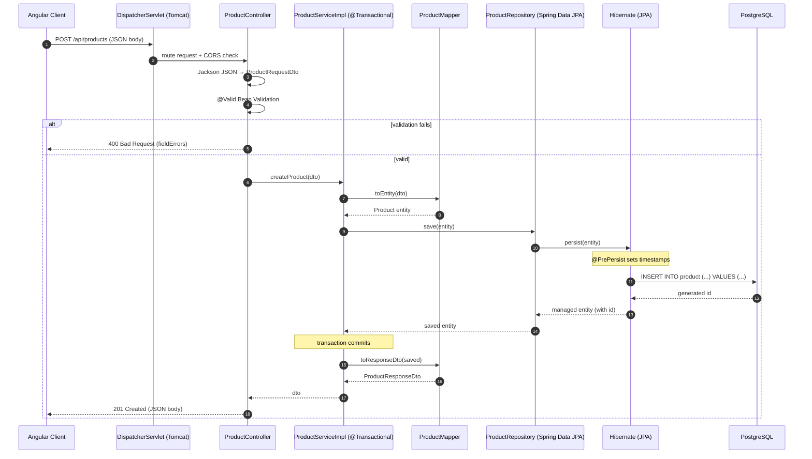

# Phase 6 — End-to-End Request Flow ⭐

[⬅ Phase 5](phase5-config-and-ops.md) · [Index](README.md) · [Next: Phase 7 ➡](phase7-interview-qa.md)

---

Follow a **`POST /api/products`** (create a product) request, step by step. This is the exact
story to tell in an interview.

## Text trace

```
① CLIENT — Angular sends POST http://localhost:8080/api/products
   Body: { "name": "Laptop", "price": 999.99, "quantity": 5 }

② EMBEDDED TOMCAT + DispatcherServlet — routes POST /api/products; CORS check (WebConfig).

③ ProductController.createProduct(@Valid @RequestBody ProductRequestDto request)
   - Jackson deserializes JSON → DTO.
   - @Valid runs Bean Validation. Invalid → 400 via GlobalExceptionHandler. (Flow stops.)
   - Valid → productService.createProduct(request)

④ ProductServiceImpl.createProduct(request)   [@Transactional opens a TX]
   - productMapper.toEntity(request) → Product entity (no id yet)
   - productRepository.save(entity)

⑤ ProductRepository.save(...) (Spring Data JPA proxy) → Hibernate EntityManager.persist()
   - @PrePersist fires → sets createdDate/updatedDate.

⑥ HIBERNATE — generates parameterized SQL:
     INSERT INTO product (name, description, price, quantity, created_date, updated_date)
     VALUES (?, ?, ?, ?, ?, ?)

⑦ JDBC → POSTGRESQL (:5432, db productdb) — inserts row via a HikariCP connection, returns id.

⑧ RETURN TRIP — id populated → @Transactional commits → mapper.toResponseDto(saved)
   → ResponseEntity.created(URI).body(dto) → HTTP 201 → Jackson serializes DTO → JSON.

⑨ CLIENT receives 201 Created with the full product JSON (including id + timestamps).
```

## Mermaid sequence diagram



## A not-found GET

`GET /api/products/{id}` (missing):
`Controller → Service.findById → repo.findById → Optional empty → throw ProductNotFoundException → GlobalExceptionHandler → 404 JSON`.

[⬅ Phase 5](phase5-config-and-ops.md) · [Index](README.md) · [Next: Phase 7 ➡](phase7-interview-qa.md)
